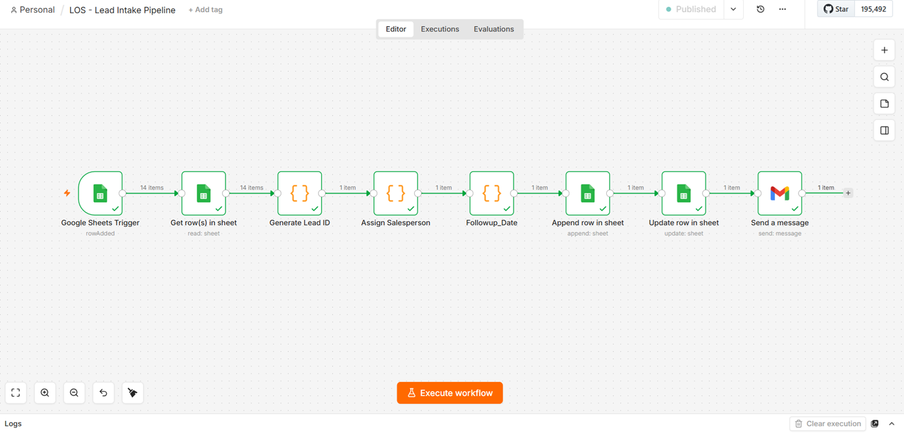
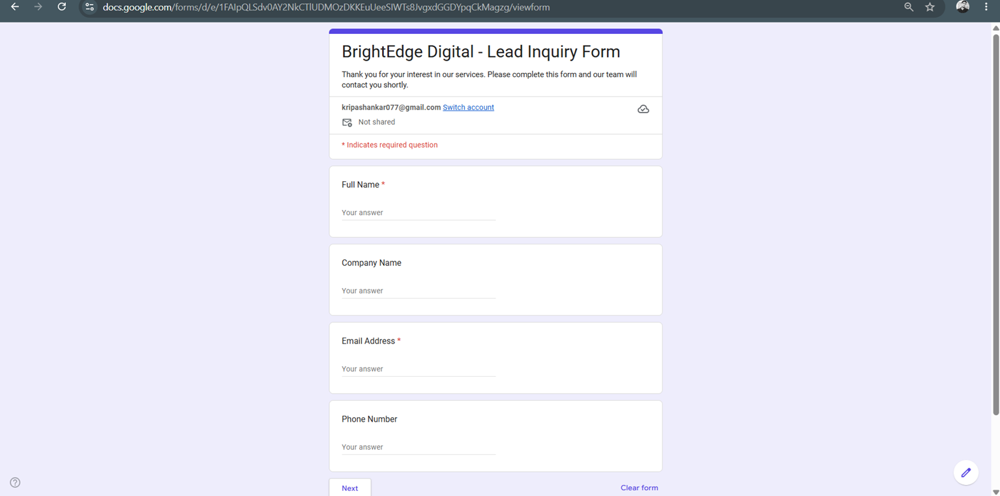
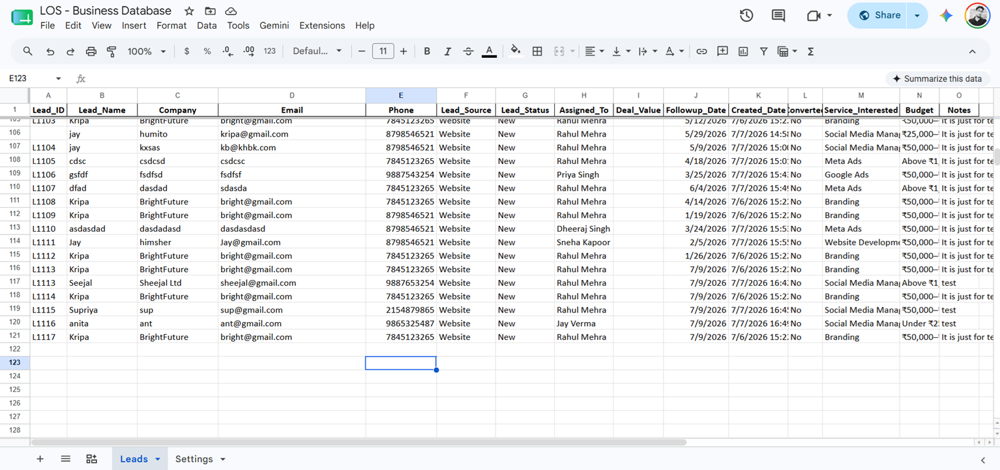
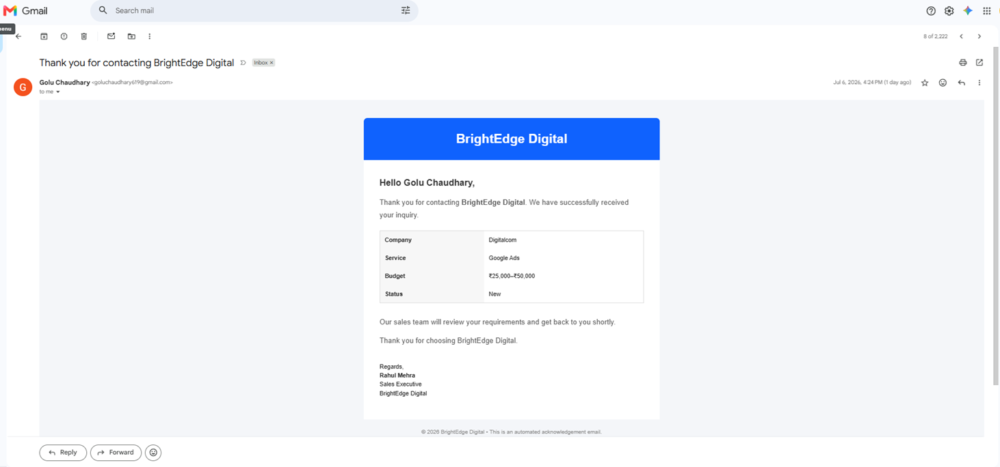

# 🚀 Lead Intake & CRM Automation System

> An end-to-end CRM Lead Management workflow built using **n8n**, **Google Forms**, **Google Sheets**, **Gmail**, and **JavaScript** to automate lead capture, lead assignment, follow-up scheduling, and customer acknowledgment emails.

---

## 📖 Project Overview

Businesses often receive leads through website contact forms, but manually recording, assigning, and following up on those leads is repetitive, time-consuming, and error-prone.

This project automates the complete lead intake process by:

- Capturing Google Form submissions in real time
- Generating unique sequential Lead IDs
- Automatically assigning leads to sales representatives
- Scheduling follow-up dates
- Storing lead information in a centralized CRM database
- Sending professional HTML acknowledgment emails to customers

---

## ✨ Features

### 📥 Real-Time Lead Capture

- Captures new submissions from Google Forms instantly
- Automatically triggers the workflow in n8n

### 🆔 Automatic Lead ID Generation

Sequential Lead IDs are generated automatically.

**Example**

- L1101
- L1102
- L1103

---

### 👨‍💼 Smart Salesperson Assignment

Leads are automatically assigned based on the selected service.

| Service | Assigned Salesperson |
|---------|----------------------|
| Branding | Rahul Mehra |
| Google Ads | Priya Singh |
| SEO | Amit Verma |
| Website Development | Sneha Kapoor |
| Social Media Management | Jay Verma |
| Meta Ads | Dheeraj Singh |

---

### 📅 Automatic Follow-up Date

Every newly created lead automatically receives a follow-up date.

**Rule**

> Created Date + 2 Days

---

### 🗂 CRM Database

The workflow automatically stores:

- Lead ID
- Customer Name
- Company
- Email
- Phone Number
- Lead Source
- Lead Status
- Assigned Salesperson
- Follow-up Date
- Created Date
- Budget
- Notes

---

### 📧 Automated HTML Email

Every customer automatically receives a professional acknowledgment email containing:

- Customer Name
- Company Name
- Selected Service
- Budget
- Assigned Sales Representative

---

## 🔄 Workflow Architecture

```text
Google Form
      │
      ▼
Google Sheets Trigger
      │
      ▼
Generate Lead ID
      │
      ▼
Assign Salesperson
      │
      ▼
Generate Follow-up Date
      │
      ▼
Append Lead to CRM Database
      │
      ▼
Update Latest Lead ID
      │
      ▼
Send HTML Confirmation Email
```

---

## 🛠 Technology Stack

- n8n
- Google Forms
- Google Sheets
- Gmail
- JavaScript
- HTML Email Templates

---

## 📊 Business Benefits

- Eliminates manual data entry
- Standardizes lead management
- Automatically assigns sales representatives
- Improves response time
- Generates unique Lead IDs
- Reduces human error
- Maintains a centralized CRM database
- Enables future reporting and analytics

---

## 📂 Repository Structure

```text
Lead-Intake-CRM-Automation/
│
├── workflow/
│   └── Lead Intake Pipeline.json
│
├── screenshots/
│   ├── workflow.png
│   ├── google-form.png
│   ├── crm-database.png
│   ├── email.png
│   ├── lead-id.png
│   └── salesperson-assignment.png
│
├── README.md
└── LICENSE
```

---

## 📸 Screenshots

### Workflow

```markdown

```

### Google Form

```markdown

```

### CRM Database

```markdown

```

### HTML Email

```markdown

```

---

## 🚀 Future Enhancements

### Version 3

- Interactive Power BI Dashboard
- Lead Conversion Analytics
- Sales Performance Dashboard
- Revenue Tracking

### Version 4

- PostgreSQL Database
- REST API Integration
- Role-based Authentication
- CRM Web Dashboard
- WhatsApp Notifications
- Automated Reminder Emails
- AI Lead Scoring

---

## 💼 Skills Demonstrated

- Workflow Automation
- Business Process Automation
- CRM Design
- JavaScript
- Google Workspace Automation
- API Integration
- Data Management
- Email Automation
- Process Optimization
- Low-Code Development
- System Design

---

## 👨‍💻 About

This project was developed as part of my workflow automation portfolio to demonstrate practical business automation using **n8n**, **Google Workspace**, and **JavaScript**.

---

## 📄 License

This project is licensed under the **MIT License**.
